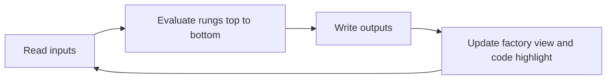
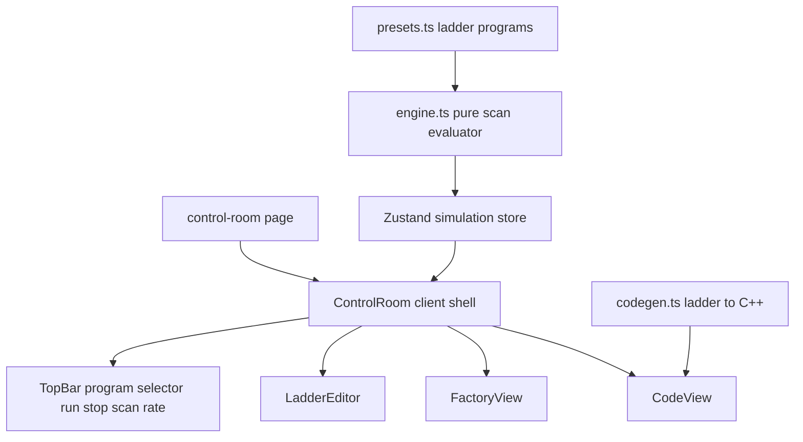

# Caleb Chua — Portfolio: Design & Implementation Plan

## 1. Overview

A personal portfolio for **Caleb Chua**, Software and System Engineer at Sensata Technologies, blending a mechatronics/PLC background with software engineering. Dark, industrial "control room" aesthetic. The centerpiece is an interactive **PLC Control Room**: a ladder logic simulator wired to a live animated factory line, with a panel showing the equivalent C++ scan-cycle code executing line-by-line.

- Stack: Next.js 15 (App Router) + TypeScript + Tailwind CSS v4 + Zustand
- Hosting: Vercel
- Pages: `/` single-page portfolio, `/control-room` interactive centerpiece

## 2. Content inventory (from provided data)

### Profile
| Field | Value |
|---|---|
| Name | Caleb Chua |
| Headline | Software and System Engineer at Sensata Technologies |
| Pronouns | He/Him |
| Location | Subang Jaya, Selangor, Malaysia |
| LinkedIn | https://linkedin.com/in/caleb-c-a9a678202 |

### Experience

**Software and System Engineer — Sensata Technologies** (Full-time, Aug 2025 – Present, Subang Jaya, on-site)
- Develop and maintain C++ and C# manufacturing applications supporting machine operations, production processes, and data tracking.
- Enhance an internal manufacturing management system using PHP, JavaScript, HTML, CSS, and SQL Server.
- Develop C# data-tracking clients for new machine integration with SQL Server.
- Troubleshoot Windows-based software, database, communication, and hardware integration issues; collaborate with cross-functional engineering teams on development and production support.

**System and Project Engineer — Precision Control Sdn. Bhd.** (Full-time, May 2023 – Aug 2025, Shah Alam, on-site)
- Developed SCADA functionality such as event logging and trend monitoring using VB script.
- Tested and troubleshot hardware and software issues during Factory Acceptance Tests for MCC/PLC panels.
- Designed and drew PLC panels for fabrication and site termination using EPLAN and AutoCAD.
- Supported customers with site program modifications and troubleshooting during production.

### Education
**UCSI — Bachelor of Mechatronics Engineering** (May 2019 – May 2023), CGPA 3.91

### Certifications
| Certification | Issuer | Date | Verify link |
|---|---|---|---|
| Hands-on Introduction to Linux Commands and Shell Scripting | IBM | Apr 2025 | coursera.org/account/accomplishments/verify/T4HG1R8JSHNO |
| Learn Intermediate Python 3: Exceptions and Unit Testing | Codecademy | Mar 2025 | — |
| Pass the Technical Interview with Java | Codecademy | Feb 2025 | — |
| Learn Object Oriented Programming (OOP) with C++ | Codecademy | Dec 2024 | — |
| Python (Basic) | HackerRank | n/a | hackerrank.com/certificates/fa96bfbd67cb |
| Foundational C# with Microsoft | freeCodeCamp | Aug 2024 | freecodecamp.org/certification/CalebChuaYangYang/foundational-c-sharp-with-microsoft |

### Skills (derived strictly from experience + certifications)
- **Languages:** C++, C#, Python, Java, PHP, JavaScript, VBScript, SQL, Bash/Shell scripting
- **Industrial systems:** PLC, SCADA, HMI, MCC/PLC panel design, EPLAN, AutoCAD, Factory Acceptance Testing
- **Web & data:** HTML, CSS, SQL Server, manufacturing management systems
- **Platforms:** Windows, Linux

## 3. Design system

Industrial control-room theme — dark graphite panels, HMI amber/green/red status colors, monospace technical accents, subtle blueprint grid background.

| Token | Value | Use |
|---|---|---|
| `bg` | `#0B0F14` | page background |
| `panel` | `#111820` | cards/panels |
| `border` | `#1F2A37` | panel borders |
| `amber` | `#F59E0B` | primary accent, HMI amber |
| `green` | `#22C55E` | running/OK state |
| `red` | `#EF4444` | stop/fault state |
| `text` | `#E5E7EB` | primary text |
| `muted` | `#94A3B8` | secondary text |

Fonts via `next/font`: Space Grotesk (display), Inter (body), JetBrains Mono (code, ladder graphics, labels).

Motion: subtle only — section fade/slide reveals, conveyor + lamp animations in Factory View. Respect `prefers-reduced-motion` (pause belt animation; simulation logic may still run with static visuals).

## 4. Site structure

### `/` — single-page portfolio
1. **Header** — sticky, anchor nav: About, Experience, Education, Certifications, Control Room (highlighted CTA)
2. **Hero** — name, headline, pronouns + location chips, LinkedIn button, primary CTA "Open the Control Room", small live teaser (mini animated stack light or scan counter)
3. **About** — short first-person paragraph bridging mechatronics and software
4. **Experience** — vertical timeline, two cards with role/company/meta/bullets; tech tags per role
5. **Education** — UCSI card with CGPA badge
6. **Certifications** — grid of cert cards (issuer, date, verify link when available)
7. **Skills** — grouped tag cloud
8. **Footer/Contact** — LinkedIn link, location, build note

### `/control-room` — the centerpiece
Full-viewport dark console. Desktop: three panels + top bar. Mobile: tab switcher between panels.

```
+--------------------------------------------------------------+
| TOP BAR: [program select] [Run/Stop] [scan rate] [Scan #000] |
+---------------+--------------------------+-------------------+
| LADDER EDITOR | FACTORY VIEW             | C++ CODE VIEW     |
| rungs + I/O   | animated production line | live highlight    |
+---------------+--------------------------+-------------------+
```

#### 4.1 Simulation engine (`lib/simulation/`, pure TypeScript, no React)
Scan cycle identical to a real PLC, ticked on an interval (default 200 ms, adjustable 50–500 ms):



- **Elements:** `ContactNO`, `ContactNC`, `Coil`, `TimerTON` (with `preset`, `elapsed`, `done` bit). Power flow evaluated left-to-right per rung, rungs top-to-bottom.
- **State:** Zustand store — inputs, outputs, timers, scanCount, running, scanRate, activeProgram, lastExecutedRung.
- Timers accumulate `elapsed += scanPeriod` while rung power is true; `done` when `elapsed >= preset`; reset when power drops.
- Seal-in works naturally: a coil's output bit can be referenced as a contact in the same or later rung.

#### 4.2 Preset programs (`presets.ts`) — real ladder patterns
1. **Start-Stop Latch** — parallel NO start / NO motor seal-in, series NC stop, coil motor. Factory: belt runs, stack light green; stop halts belt, light amber.
2. **Photo-Eye Ejector** — NO photoEye, TON 1.5 s, coil pusher; counter increments per eject. Factory: boxes ride the belt, pusher kicks them off, 7-segment counter ticks.
3. **Flashing Beacon** — two-TON oscillator at 1 Hz driving an amber beacon. Factory: stack light amber lamp flashes, belt idle.

Each preset ships with: ladder definition, input list, factory binding, and a short first-person note on why the pattern matters on the factory floor.

#### 4.3 Ladder Editor panel
- Renders rungs as SVG/CSS ladder graphics: power rails, NO contacts, NC contacts, coils, TON timer blocks.
- Live power-flow highlighting (energized segments glow amber).
- Input toggle switches (Start, Stop, Photo-eye) as industrial toggle controls.
- Clicking a contact toggles its input; hover tooltips explain each element.
- Program selector loads presets; editing rung structure is a stretch goal, not required for launch.

#### 4.4 Factory View panel (SVG, no canvas)
- Conveyor belt with moving boxes (CSS transform animation, gated by motor output)
- Photo-eye with beam + sensor flash
- Pneumatic pusher arm (translate on pusher output)
- Stack light tower (red/amber/green lamps bound to outputs)
- 7-segment style counter display
- Status readouts: RUN/STOP, scan count, scan period

#### 4.5 Code View panel
- `codegen.ts` compiles the current ladder program into readable C++ mirroring the scan cycle:

```cpp
void plc_scan() {
    // Read inputs
    bool start = read_input("START");
    bool stop  = read_input("STOP");

    // Rung 1: seal-in starter
    if ((start || outputs.motor) && !stop) {
        outputs.motor = true;
    } else {
        outputs.motor = false;
    }

    // Write outputs
    write_output("MOTOR", outputs.motor);
}
```

- The line corresponding to the rung currently being evaluated glows during each scan — visitors literally watch the scan cycle execute.
- Header note: "How I translate ladder logic into C++" (personal touch).

#### 4.6 Component map



## 5. File structure

```
Portfolio/
├── app/
│   ├── layout.tsx              # fonts, metadata, header/footer
│   ├── page.tsx                # single-page portfolio
│   ├── globals.css             # Tailwind v4 + theme tokens
│   └── control-room/page.tsx
├── components/
│   ├── layout/Header.tsx, Footer.tsx
│   ├── sections/Hero.tsx, About.tsx, Experience.tsx,
│   │              Education.tsx, Certifications.tsx, Skills.tsx
│   └── control-room/
│       ├── ControlRoom.tsx     # client shell + scan loop
│       ├── TopBar.tsx
│       ├── LadderEditor.tsx
│       ├── Rung.tsx
│       ├── FactoryView.tsx
│       ├── CodeView.tsx
│       └── MobileTabs.tsx
├── lib/
│   ├── data/profile.ts, experience.ts, education.ts,
│   │      certifications.ts, skills.ts
│   └── simulation/
│       ├── types.ts            # element + program types
│       ├── engine.ts           # scan-cycle evaluator
│       ├── codegen.ts          # ladder to C++
│       └── presets.ts          # three preset programs
└── plans/portfolio-plan.md
```

## 6. Implementation steps

Tracked in the todo list: scaffold → design system → content data → layout/sections → simulation engine → presets → codegen → three panels → assembly → polish (responsive, reduced-motion, a11y, SEO/OG, favicon) → production build + Vercel deploy prep.

## 7. Notes & edge cases
- No email provided → LinkedIn is the sole contact channel; add email later if desired.
- Codecademy certs have no public verify URLs → render issuer + date only.
- HackerRank cert has no visible date → show "Verified" badge without a date.
- All simulation logic is pure TypeScript and unit-testable; React only renders state.
- Keep bundle lean: SVG + CSS animations, no canvas/physics libraries.
- SEO: metadata + OpenGraph on both pages; OG image can be a Control Room screenshot (stretch).
